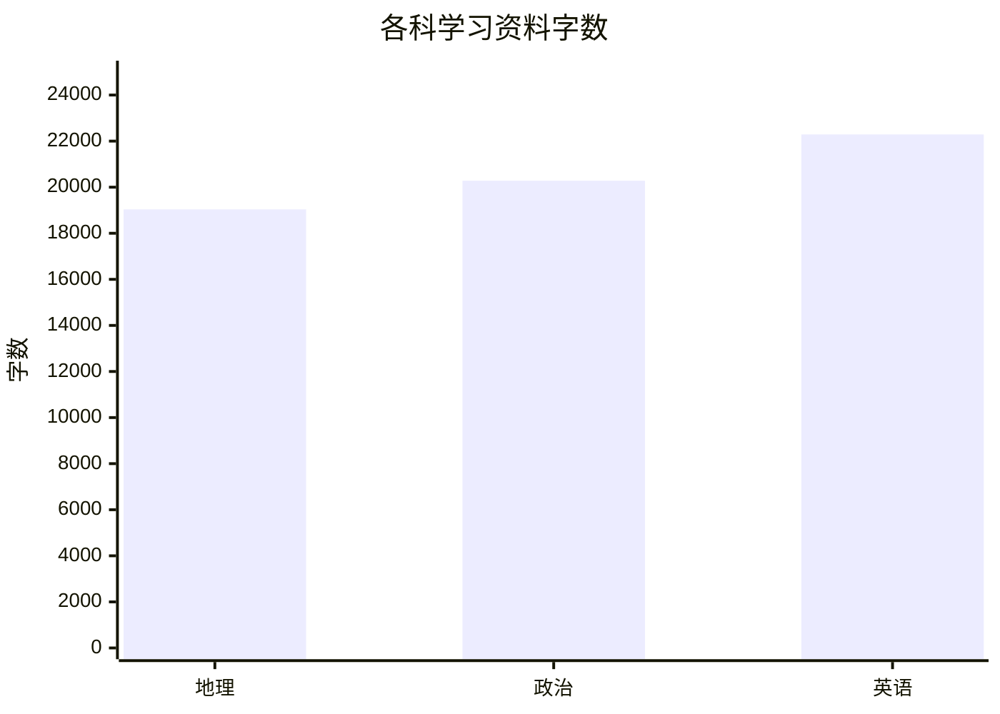
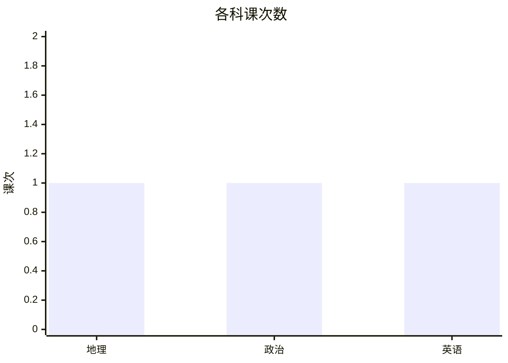
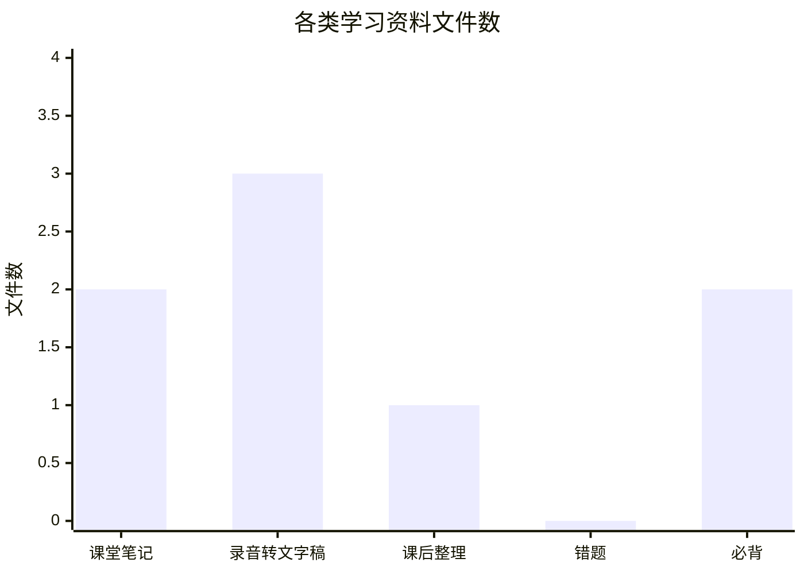

# Learning-Library

> 用于长期保存、整理和复习网课学习资料的结构化学习知识库。

仓库按 **科目 → 学习阶段 → 课堂 → 课次** 组织。课堂录音转文字稿、课堂笔记、课后整理、必背、错题等资料均跟随对应课次保存，并使用统一命名规则。

## 📊 学习数据

<!-- STATS:START -->
### 总览

| 指标 | 数量 |
| --- | ---: |
| 学科数 | 3 |
| 课次数 | 3 |
| 学习资料文件数 | 10 |
| 学习资料总字数 | 61,604 |
| 课堂笔记文件数 | 2 |
| 录音转文字稿文件数 | 3 |
| 课后整理文件数 | 1 |
| 错题文件数 | 0 |
| 必背文件数 | 2 |

### 各科统计

| 科目 | 课次 | 文件数 | 字数 | 课堂笔记 | 录音转写 | 课后整理 | 错题 | 必背 |
| --- | ---: | ---: | ---: | ---: | ---: | ---: | ---: | ---: |
| 地理 | 1 | 4 | 19,037 | 0 | 1 | 1 | 0 | 1 |
| 政治 | 1 | 3 | 20,279 | 1 | 1 | 0 | 0 | 1 |
| 英语 | 1 | 3 | 22,288 | 1 | 1 | 0 | 0 | 0 |

### 自动图表

#### 各科字数



#### 各科课次数



#### 资料类型文件数



**统计口径：** 仅统计各学科目录内的 `.md`、`.txt` 学习资料；排除 `README.md`、`_rules/`、`.github/`、`scripts/` 等管理与自动化文件。“字数”按中文字符、英文单词和数字序列统计。不统计任何文件内部的错题数、必背条目数、知识点数等条目数量。
**最后自动统计：** 2026-09-11 09:28（北京时间）
<!-- STATS:END -->

## 📁 资料组织

```text
Learning-Library/
├── _rules/                         # 仓库规则
├── 政治/
│   └── 2026-首考/
│       ├── 课堂/
│       │   └── 政治1_必修一第1-2课_2026-09-08_周二/
│       │       ├── 政治1_课堂录音转文字稿_必修一第1-2课_2026-09-08_周二.md
│       │       ├── 政治1_课堂笔记_必修一第1-2课_2026-09-08_周二.md
│       │       ├── 政治1_课后整理_必修一第1-2课_2026-09-08_周二.md
│       │       ├── 政治1_必背_必修一第1-2课_2026-09-08_周二.md
│       │       └── 政治1_错题_必修一第1-2课_2026-09-08_周二.md
│       └── 公共资料/
├── 英语/
├── 数学/
└── 语文/
```

## 🏷️ 文件命名

课堂资料统一使用：

```text
科目+课次_资料类型_课程内容_YYYY-MM-DD_周X.扩展名
```

例如：

```text
政治1_课堂笔记_必修一第1-2课_2026-09-08_周二.md
政治1_必背_必修一第1-2课_2026-09-08_周二.md
政治1_错题_必修一第1-2课_2026-09-08_周二.md
```

日期均按**北京时间**记录。

## 📖 仓库规则

- [仓库存储规范](_rules/存储规范.md)
- [错题存储规范](_rules/错题存储规范.md)
- [必背记录规范](_rules/必背记录规范.md)

具体资料的创建、整理、命名和修改均以 `_rules/` 中的规则为准。

## ⚙️ 自动统计

每次课程资料提交到 `main` 后，GitHub Actions 自动重新统计 README 中的学习数据，只更新 `<!-- STATS:START -->` 与 `<!-- STATS:END -->` 之间的统计区域。

自动统计包括：

- 学科数
- 课次数
- 学习资料文件数
- 学习资料总字数
- 课堂笔记文件数
- 录音转文字稿文件数
- 课后整理文件数
- 错题文件数
- 必背文件数
- 各学科对应的课次、文件数和字数

自动图表包括：

- 各科学习资料字数
- 各科课次数
- 各类学习资料文件数

图表直接使用 README 内的 Mermaid 生成，不创建 PNG、JPG 等图片文件。统计程序不会修改任何课程资料文件，也不会统计错题条数、必背条目数等文件内部条目数量。