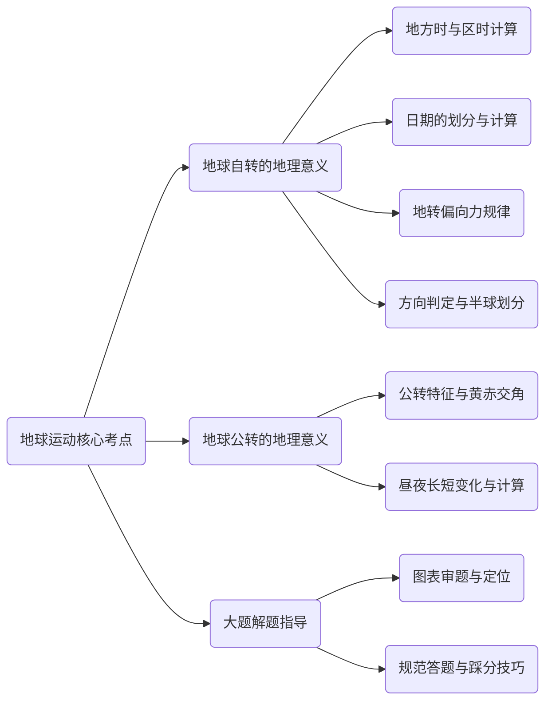

# 地球运动（自转与公转）核心考点笔记

## 一、 思维导图总览

## 二、 核心考点：地球自转及其地理意义

### 1. 基础特征与方向

- **自转方向**：北半球俯视呈逆时针方向旋转，南半球俯视呈顺时针方向旋转（北逆南顺）。
- **经纬度变化规律**：顺着地球自转方向，东经度数逐渐增大，西经度数逐渐减小。

### 2. 地方时与区时（【考试高频考点】）

- **地方时判定**：地方时由经线决定，同一经线的地方时相同，不同经线的地方时一定不同。
- **标准时间**：太阳直射时为正午，正午时分太阳高度角最高，当地地方时为12点，0度经线（格林尼治天文台）为最标准的参考经线。
- **时间计算口诀**：东早西迟，东加西减，同减异加，15差1（经度每相差15°，时间相差1小时）。
- **区时划分**：每个时区中央经线的地方时就是该时区的区时。
- **中央经线计算**：中央经线的度数 = 15^\circ \times \text{时区数}（例如东八区中央经线为120°E）。
- **时区范围**：每个时区跨度15°，时区经度范围等于该区中央经线度数 \pm 7.5^\circ。已知经度求时区，用经度除以15°，余数大于7.5则商加1，余数小于7.5则为商。
- **早晚极值**：东十二区是全球最早的时区，西十二区是全球最晚的时区。

### 3. 日期的划分（【考试重难点】）

- **日期分界线**：全球日期的变化由两根线决定，分别是运动的180°经线和静止的0时（零时）经线。
- **今天与昨天**：从0时经线向东至180°经线是“今天”的范围，从0时经线向西至180°经线是“昨天”的范围。
- **时间占比推算**：180°经线的地方时是几点，进入新的一天（今天）的区域所占时间就是几个小时。
- **全球同日**：当180°经线与0点（24点）经线重合时，全球处于同一个日期。
- **日界线特征**：跨越180°经线并不一定跨过日界线，两者并不完全重合。

### 4. 晨昏线的应用

- **交点时间**：晨线与赤道的交点所在经线的地方时为6点，昏线与赤道的交点所在经线的地方时为18点。
- **夹角变化**：只有在春秋分时，晨昏圈才与经线圈完全重合；夏至、冬至时晨昏线与地轴夹角最大（23^\circ 26'）。

### 5. 地转偏向力与方向判定

- **偏转规律**：水平运动物体受地转偏向力影响，北半球向右偏，南半球向左偏，赤道上不偏转。
- **河流侵蚀**：受偏转力影响，水流偏向的一岸（如北半球右岸）以侵蚀为主（坡度较陡），另一岸（左岸）以堆积为主。纬度越高，偏转幅度越大。
- **东西半球划分**：分界线是20°W和160°E，20°W向东至160°E所在的区域为东半球，其余为西半球。
- **南北方向**：南北是有限方向，越靠近北极点越北，越靠近南极点越南。站在北极点，四面八方都向南。
- **东西方向**：东西方向是无限方向，顺着地球自转方向位置偏东的在东。两地若分别为东西经，度数之和大于180°则西经度在东，度数之和小于180°则东经度在东。

## 三、 核心考点：地球公转及其地理意义

### 1. 公转速度与黄赤交角

- **公转速度**：1月初地球公转至近日点，速度最快；7月初公转至远日点，速度最慢。
- **黄道与赤道**：地球公转的轨道平面称为黄道平面，与赤道平面之间存在黄赤交角。
- **角度关联**：目前黄赤交角的度数是 23^\circ 26'，等于回归线的度数，也等于 90^\circ 减去极圈的度数。
- **影响**：若黄赤交角变大，则热带和寒带的范围变大，温带的范围变小。

### 2. 昼夜长短变化与计算（【考试重点应用】）

- **春秋分**：全球昼夜平分，即各纬度均为12小时白天，12小时黑夜。
- **夏至日（6月22日）**：太阳直射北回归线，北半球昼最长、夜最短，且纬度越高昼越长，昼夜变化幅度越大；北极圈及其以北地区出现极昼现象。
- **冬至日**：太阳直射南回归线，北半球昼最短、夜最长，纬度越高昼越短；北极圈及其以北地区出现极夜现象。
- **极圈现象规律**：南北极点各有一半的时间（半年）处于极昼或极夜；南北极圈各有1天的极昼或极夜；极圈以内纬度越高，极昼极夜的天数越多。
- **计算公式**：
  - 昼长 = 昼弧度数 \div 15^\circ。
  - 昼长 = (正午12点 - 日出时间) \times 2 = (日落时间 - 正午12点) \times 2。
- **核心推论**：
  - 太阳直射点在哪个半球，哪个半球就昼长夜短。
  - 赤道上终年昼夜平分（6点日出，18点日落）。
  - 同纬度各地昼长相等、夜长相等。
  - 对称思想：南北半球纬度数值相等的地区，昼夜长短对称分布（如北半球某地的昼长等于南半球同纬度地区的夜长）。

## 四、 易错易混点排雷

- **避坑1**：东西半球的分界线绝对不是0°和180°，必须牢记是 **20°W 和 160°E**。
- **避坑2**：地方时与区时的概念不能混淆。地方时随经度每一度都有改变，而区时是整个时区共用中央经线的地方时。
- **避坑3**：南北半球季节相反。在看南半球气候图表时，需注意其7月份为冬季，1月份为夏季，切勿将气温降水柱状图看反。

## 五、 大题解题指导与实战思维

### 1. 审题与空间定位

- **提取关键信息**：面对综合大题，首要任务是阅读图文材料获取经纬度坐标，据此判断目标区域位于南半球还是北半球、东半球还是西半球。
- **图表要素挖掘**：充分利用题目给定的图例信息，例如海拔高度、河流走向、海陆位置（如靠近大西洋）等自然要素。

### 2. 气候图表分析法

- **气温降水研判**：结合气温和降水柱状图特征推导气候类型（如气温最冷月仍在10℃以上，降水充沛且分配具有规律性，推断其对应的气候类型及特征）。
- **顺应材料作答**：即便无法瞬间精确判定气候学名，也应当将图表中直观呈现的“降水充沛”、“气候适宜”等特征作为踩分点写在答题卡上。

### 3. 措施与意义类问题发散（以低碳养牛为例）

- **紧扣核心诉求**：围绕题干“减少碳排放”、“增加碳汇”的目的，针对性提出措施。例如使用清洁能源以减少汽车尾气排放，提高环节效率，或通过修建人工草场、保护草场来增加碳汇。
- **多维度拓展**：被问及推广某种模式（如低碳养牛）的理由时，应向“环保”、“绿色经济”、“食品安全”、“推广就业”以及“提高市场竞争力”等多个得分维度发散。
- **答题规范**：根据题目分值预估答题点数量（通常6分题需作答3点），自然与人文地理因素相结合，条理清晰。